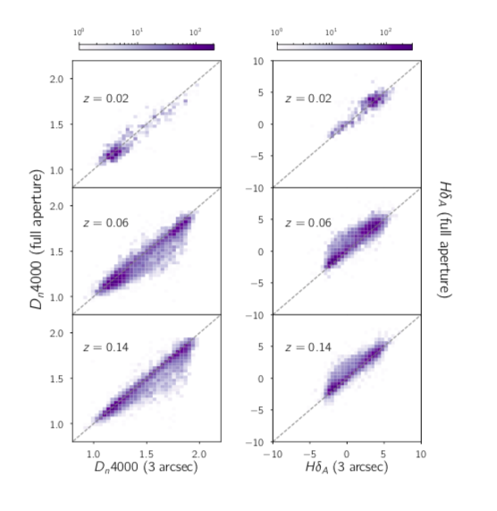

# aperture_effects
The following is a description of the context of the code and the problem statement. The notebook describes the calculation for a single galaxy, how <i>aperture_spec.py</i> works and how to use <i>aperture_spec.py</i> to obtain multiple aperture measurements of any spectral indicator for any galaxy.

<h1>Aperture effects in Galaxy Mass Estimation</h1>

One of the most widely used Galaxy Mass catalogues,
the [MPA-JHU catalog](https://www.sdss.org/dr15/data_access/value-added-catalogs/?vac_id=mpa-jhu-stellar-masses), relies on SDSS (Sloan Digital Sky Survey) spectra and SDSS photometry to constrain galaxy masses.

The [SDSS spectra](https://www.sdss.org/dr12/spectro/) are taken using optical fibers with
an angular diameter of 180 micrometers, i.e. spanning 3 arcseconds
in the sky. Thus the spectra are obtained for only a <b>fraction
of the galaxy</b>.

The MPA-JHU mass estimation method uses two key spectral indicators to constrain
the mass-to-light ratio of a galaxy. The HδA and Dn4000 indicators together provide
a powerful constraint on the stellar mass content of a galaxy. However since the spectra
are not obtained for the whole galaxy, the following questions are of concern while using
these masses:

When and where do they fail? Does the fundamental assumption
that the mass-to-light ratio at the center of a galaxy is indicative of the total
mass-to-light ratio hold good for all galaxies? In particular how are low, medium
and high redshift galaxy masses offset from their whole aperture measurements?

With the advent of [Integral Field Units](https://www.sdss.org/dr13/manga/manga-tutorials/what-is-ifu-spectroscopy/), we can now obtain spatially resolved spectra of galaxies that will allow us to test the aperture effects
in galaxy mass estimation.The largest IFU-based survey currently underway is
[MaNGA (Mapping Nearby galaxies at Apache Point)](https://www.sdss.org/surveys/manga/) and I use 6400
galaxies from MaNGA and employ the same mass estimation as the MPA-JHU
at multiple apertures.

<figure>
    

        
        <figcaption><i>Schematic of MaNGA IFU and the spatially
        resolved spectra obtained; Image Credit: Dana Berry / SkyWorks Digital Inc., David Law, and
        the SDSS collaboration</i></figcaption>
    

</figure>

<h1> Getting a Multiple Aperture View </h1>

<figure>
    

        
        <figcaption> <i>A sample MaNGA galaxy at a redshift of z = 0.0392 viewed
         through the IFU. .</i></figcaption>
    

</figure>

For every such galaxy, the output of the data reduction pipeline is a "datacube", a 3D array with 2 spatial dimensions and one spectral
dimension. We study the galaxy properties, thus in this so-called spaxel (spatial + pixel) space. For the galaxy shown above, I have
plotted the flux as a function of the spaxel space in the following plot. The circles show the 3'' view of the galaxy (akin to what
  the SDSS spectra would see) if the galaxy were shifted to higher redshifts.

<figure>
    

        
        <figcaption><i> The 3'' view of the same galaxy at
         multiple reshifts; the colorbar shows the total flux from each spaxel in units of
         ergs/cm^2/s.</i></figcaption>
    

</figure>

<h1> How offset are the indicators at varying apertures? </h1>

For any MaNGA galaxy at redshift zobs, we can thus simulate what the SDSS Main Sample spectrum would have looked like if it had observed the galaxy at that redshift or any higher redshift. We simply calculate the spectrum within an aperture that is 3′′ diameter (if we are simulating the Main Sample spectrum at zobs) or larger (if we are simulating the spectrum at a larger z). For any spectral measurement we can then compare the measurement of the total spectrum in the MaNGA cube to that which would have been measured through a 3′′ aperture at a given redshift.

Since galaxies come in a range of sizes and spectral profiles, this difference will vary from galaxy to galaxy and we must look at a large sample. Importantly, for a chosen redshift znew at which to evaluate the degree of bias, we can only use a sample of galaxies with zobs ≤ znew.

Two key spectral indicators used in estimating galaxy masses in the MPA-JHU catalog are the Balmer Delta absorption line (HδA) and the
4000 Angstrom break (Dn4000) in galaxies. For the  MaNGA galaxies surveyed so far, I use <b><i>aperture_spec.py</i></b> to estimate these indicators.

To investigate how the full aperture measurements compare to the 3′′ measurements, I choose 3 different redshift bins z = 0.02, 0.06, and 0.14, and determine how offset the HδA and Dn4000 measures are. For each redshift z, I pick the galaxies with redshifts zobs < z, “shift” them to the cutoff redshift, and compare the full aperture measurements to the 3′′ measurements that would be made at redshift z.

The results of this procedure are shown in below, where the full aperture measurements are plotted against the 3′′ measurements at the each redshift, with the colorbars indicating the number of galaxies in each bin. The total number of galaxies at each redshift is 561 for z = 0.02, 5016 for z = 0.06 and 6402 for z = 0.14.

The plot shown below shows how the 3'' measurements at the redshift of the galaxy compares to the full aperture measurement at three znew redshifts.

<figure>
    

        
        <figcaption><i> A comparison of full aperture vs 3'' measurements of the two key spectral indicators that go into the galaxy mass calculation as per the MPA-JHU method.</i></figcaption>
    

</figure>
