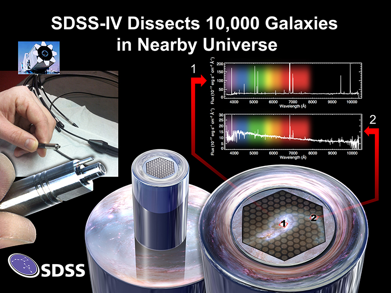
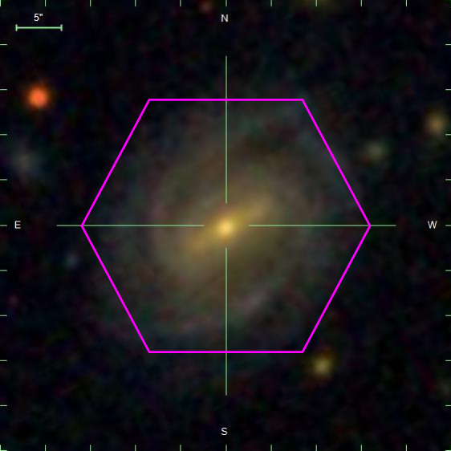
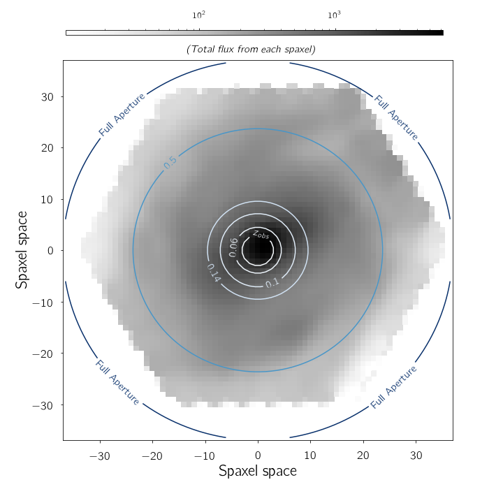

# aperture_effects
The following is a description of the problem statement. The notebook describes the calculation for a single galaxy, how
<i>aperture_spec.py</i> works and how to use <i>aperture_spec.py</i> to obtain multiple aperture measurements of any spectral indicator for any galaxy.

<h1>Aperture effects in Galaxy Mass Estimation</h1>

One of the most widely used Galaxy Mass catalogues,
the [MPA-JHU catalog](https://www.sdss.org/dr15/data_access/value-added-catalogs/?vac_id=mpa-jhu-stellar-masses), relies on SDSS (Sloan Digital Sky Survey) spectra and SDSS photometry to constrain galaxy masses.

The [SDSS spectra](https://www.sdss.org/dr12/spectro/) are taken using optic fibers with
an angular diameter of 180 micrometers, i.e. spanning 3 arcseconds
in the sky. Thus the spectra are obtained for only a fraction
of the galaxy.

With the advent of [Integral Field Units](https://www.sdss.org/dr13/manga/manga-tutorials/what-is-ifu-spectroscopy/), we can now obtain spatially resolved spectra of galaxies that will allow us to test the aperture effects
in galaxy mass estimation.The largest IFU-based survey currently underway is
[MaNGA (Mapping Nearby galaxies at Apache Point)](https://www.sdss.org/surveys/manga/) and I use 6000
galaxies from MaNGA and employ the same mass estimation as the MPA-JHU
at multiple apertures.

<figure>
    

        
        <figcaption><i>Schematic of MaNGA IFU and the spatially
        resolved spectra obtained.&nbsp;</i></figcaption>
    

</figure>
&nbsp;
&nbsp;

<h1> Getting a Multiple Aperture View </h1>

<figure>
    

        
        <figcaption> <i>A sample MaNGA galaxy at a redshift of z = 0.0392 viewed
         through the IFU; Image Credit: Dana Berry / SkyWorks Digital Inc., David Law, and the SDSS collaboration.</i></figcaption>
    

</figure>
&nbsp; &nbsp;  

For every such galaxy, the output of the data reduction pipeline is a "datacube", a 3Darray with 2 spatial dimensions and one spectral
dimension. We study the galaxy properties, thus in this so-called spaxel (spatial + pixel) space. For the galaxy shown above, I have
plotted the flux as a function of the spaxel space in the following plot. The circles show the 3'' view of the galaxy (akin to what
  the SDSS spectra would see) if the galaxy were shifted to higher redshifts.
&nbsp;
&nbsp;

<figure>
    

        
        <figcaption><i> The 3'' view of the same galaxy at
         multiple reshifts </i></figcaption>
    

</figure>

<h1> How offset are the indicators at varying apertures? </h1>
